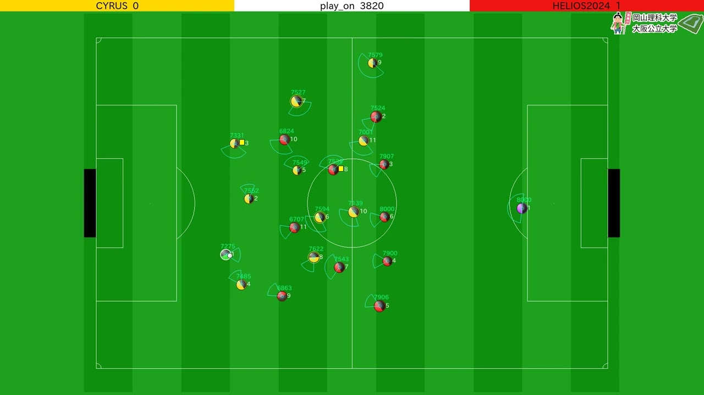

The RoboCup Soccer Simulator is a research and educational tool for multiagent systems and artificial intelligence. It enables for two teams of 11 simulated autonomous robotic players to play soccer (football).

<!-- truncate -->

Without the neccessity to maintain any robot hardware, the RoboCup Simulation League’s focus comprises artificial intelligence and team strategy.

In the 2D Simulation League, two teams of eleven autonomous software programs (called agents) each play soccer in a two-dimensional virtual soccer stadium represented by a central server, called SoccerServer. This server knows everything about the game, i.e. the current position of all players and the ball, the physics and so on. The game further relies on the communication between the server and each agent. On the one hand each player receives relative and noisy input of his virtual sensors (visual, acustic and physical) and may on the other hand perform some basic commands (like dashing, turning or kicking) in order to influence its environment.

The big challenge in the Simulation League is to conclude from all possible world states (derived from the sensor input by calculating a sight on the world as absolute and noise-free as possible) to the best possible action to execute. As a game is divided into 6000 cycles this task has to be accomplished in time slot of 100 ms (the length of each cycle). Further information and the SoccerServer software can be accessed via [https://github.com/rcsoccersim/](https://github.com/rcsoccersim/).
