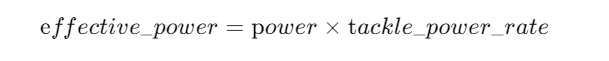

# Tackle Model

The tackle command is to accelerate the ball towards the player's
body(**TODO:new tackle model \[12.0.0 pre-20080210\]**).
Players can kick the ball that can not be kicked with the kick command
by executing the tackle command.
The success of tackle depends on a random probability related to the
position of the ball. It can be obtained by the following formula.

The probability of a tackle failure when the ball is in front of the player is:

  

The probability of a tackle failure when the ball is behind the player is:

  

The probability of processing success is:

  

In this case, when the ball is in front of the player, it is used to *tackle_dist* (default is 2.0), otherwise it is used to **tackle_back_dist** (default is 0.5); **player_to_ball** is a vector from the player to the ball, relative to the body direction of the player. When the tackle command is successful, it will give the ball an acceleration in its own body direction.

The execution effect of tackle is similar to that of kick, which is obtained by multiplying the parameter **tackle_power_rate** (default is 0.027) with power. It can be expressed by the following formula:

  

Once the player executes the tackle command, whether successful or not, the player can no longer move within 10 cycles. The following table shows the parameters used in tackle command.

**TODO**

- \[12.0.0 pre-20080210\] new kick/tackle noise model
- \[12.0.0 pre-20080210\] max_back_tackle_power
- \[13.0.0\] forbid backward tackle
- \[14.0.0\] increasing tackle noise using server::tackle_rand_factor

| Parameter in `server.conf`               | Value     |
|-------------------------------------------|-----------|
| tackle_dist                               | 2         |
| tackle_back_dist                          | 0         |
| tackle_width                              | 1.25      |
| tackle_cycles                             | 10        |
| tackle_exponent                           | 6         |
| tackle_power_rate                         | 0.027     |
| max_tackle_power                          | 100       |
| max_back_tackle_power                     | 0         |
| tackle_rand_factor                        | 2         |

