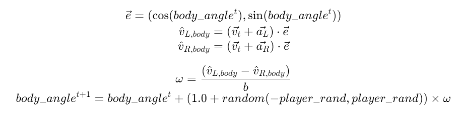

## Bipedal Dash Model
Since rcssserver version 19, a bipedal dash model has been introduced.
In the bipedal model, players can independently issue dash commands to the left and right legs.
This means that players can now apply different accelerations to each leg.
With the bipedal dash model, players can perform acceleration and direction changes simultaneously.
The bipedal dash model is based on the differential drive dynamics model used in two-wheeled mobile robots and is available regardless of the client version.

In the bipedal dash model, parameters can be independently assigned to each leg using the dash command.
The parameters, namely power and direction, are the same as the dash command in versions 18 and earlier.
The derivation formula for acceleration obtained for each leg also follows the conventional model.
The differences from the conventional model lie in the stamina consumption,
the derivation formula for the player's body acceleration obtained as a result,
and the player's rotation based on the speed difference between both legs.

Stamina consumed by each leg is half of the conventional model.
The overall stamina consumption is the sum of stamina consumption for both legs.
In other words, when the same power is applied to both legs `(dash (l power dir) (r power dir))`,
the stamina consumption is the same as applying that power to both legs in the conventional model `(dash power dir)`.

The dash command can be issued not only simultaneously to both legs but also separately.
Even if the dash command is issued separately,
as long as a dash command has been issued to both legs by the time of the cycle update,
the same effect as issuing simultaneously can be achieved.
If the dash command is issued to only one leg, rotation of the player does not occur,
and acceleration is obtained solely from the individual leg.

Based on the given command parameters, velocity is first derived for each leg.
This derivation formula is the same as the conventional model.
Provisional accelerations $\hat{a}_L$ and $\hat{a}_R$ are independently calculated for each leg.
Next, the current player velocity $v_t$ and the provisional velocities $\hat{v}_L$ and $\hat{v}_R$
for each leg are obtained from the provisional accelerations.
The provisional velocity $\hat{v}^{t+1}$ for the player's body is then determined by the average of $\hat{v}_L$ and $\hat{v}_R$.
The player's body acceleration $a^t$ is reverse-calculated from the difference between $\hat{v}^{t+1}$ and $v^t$.
Noise is added according to the update formula in section [], and the velocity for the next step, $v{t+1}$, is updated.

<!---Correct this refrence later--->

  
  

When dash parameters are assigned to both legs and there is a difference in the velocity component of each leg in the body direction,
the player rotates based on that speed difference.
The rotation dash_model_equation is identical to the differential drive kinematics.

  
  

where $\omega$ is the angular velocity,
and $b$ is the width between wheels (=player_size x 2).
