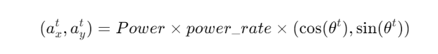
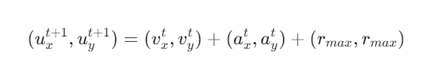
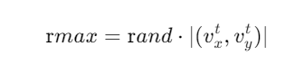
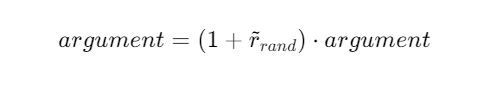

# Movement Models

## Basics

In each simulation step, movement of each object is calculated as following manner:

  

where, $(p_x^t,p_y^t)$, and $(v_x^t,v_y^t)$ are respectively position
and velocity of the object in timestep $t$. decay is a decay parameter
specified by `ball_decay` or `player_decay`. $(a_x^t,a_y^t)$ is
acceleration of object, which is derived from Power parameter in `dash`
(in the case the object is a player) or `kick` (in the case of a ball)
commands in the following manner:

  

where $\theta^t$ is the direction of the object in timestep $t$ and
power_rate is `dash_power_rate` or is calculated from `kick_power_rate`
as described in Sec. []`sec-kickmodel`.<!---Correct this refrence later--->
In the case of a player, this is just the direction the player is facing.
In the case of a ball, its direction is given as the following manner:

  

where $\theta^t_{ball}$ and $\theta^t_{kicker}$ are directions of
ball and kicking player respectively, and *Direction* is the second parameter
of a **kick** command.

## Movement Noise Model

In order to reflect unexpected movements of objects in real world,
rcssserver adds noise to the movement of objects and parameters of commands.

Concerned with movements,
noise is added into Eqn.:ref:`eq:u-t` as follows:
<!---Correct this refrence later--->
**TODO: new noise model. See \[12.0.0 pre-20071217\] in NEWS**

  

where $\tilde{r}_{\mathrm rmax}$ is a random number whose distribution
is uniform over the range $[-{\mathrm rmax},{\mathrm rmax}]$.
${\mathrm rmax}$ is a parameter that depends on amount of velocity
of the object as follows:

  

where ${\mathrm rand}$ is a parameter specified by **server::player_rand**
or **server::ball_rand**.

Noise is added also into the *Power* and *Moment* arguments of a
command as follows:

  

## Collision Model

### Collision with other movable objects

If at the end of the simulation cycle, two objects overlap, then the
objects are moved back until they do not overlap.
Then the velocities are multiplied by -0.1.
Note that it is possible for the ball to go through a player as long
as the ball and the player never overlap at the end of the cycle.

### Collision with goal posts

Goal posts are circular with a radius of 6cm and they are located at:

  

The goal posts have different collision dynamics than other
objects. An object collides with a post if it's path gets within
object.size + 6cm of the center of the post. An object that
collides with the post bounces off elastically.
