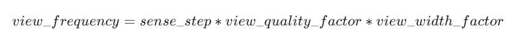
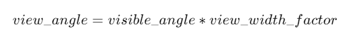
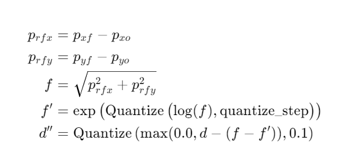
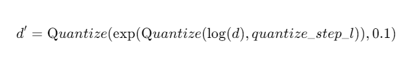
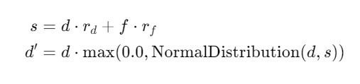

# Sensor Models
A RoboCup agent has three different sensors (and one special sensor).
The aural sensor detects messages sent by the referee, the coaches and the
other players.
The visual sensor detects visual information about the field, like the
distance and direction to objects in the player's current field of
view. The visual sensor also works as a proximity sensor by "seeing"
objects that are close, but behind the player.
The body sensor detects the current "physical" status of the player, like
its stamina, speed and neck angle.
Together the sensors give the agent quite a good picture of the environment.

## Aural Sensor Model

Aural sensor messages are sent when a client or a coach sends a say command.
The calls from the referee is also received as aural messages.
All messages are received immediately.

The format of the aural sensor message from the soccer server is:

> (hear  *Time*  *Sender*  ''*Message*'')

- *Time* indicates the current time.

- *Sender* is the relative direction to the sender if it is another player,
  otherwise it is one of the following:

  - `self`: when the sender is yourself.
  - `referee`: when the sender is the referee.
  - `online_coach_left` or `online_coach_right`: when the sender is one of the online coaches.

- *Message* is the message. The maximum length is **server::say_msg_size** bytes.
  The possible messages from the referee are described in Section [Play Modes and referee messages](referee-model.md).

The server parameters that affects the aural sensor are described in Table.

| Parameter in server.conf | Value |
|--------------------------|-------|
| audio_cut_dist           | 50.0  |
| hear_max                 | 1     |
| hear_inc                 | 1     |
| hear_decay               | 1     |


### Capacity of the Aural Sensor

A player can only hear a message if the player's hear capacity is at least
**server::hear_decay**, since the hear capacity of the player is decreased by
that number when a message is heard.
Every cycle the hear capacity is increased with **server::hear_inc**.
The maximum hear capacity is **server::hear_max**.
To avoid a team from making the other team's communication useless by
overloading the channel the players have separate hear capacities for each team.
With the current server.conf file this means that a player can hear at most
one message from each team every second simulation cycle.

If more messages arrive at the same time than the player can hear, the messages
actually heard are chosen randomly.
This rule does not include messages from the referee, or messages from oneself.
From rcssserver 8.04, players can send `attentionto` commands to focus their attention on a particular player.

### Focus

If the player focuses on player A from team T (AKA pTA), the player will
hear one message selected randomly from the say messages issued by pTA
in the previous cycle. If pTA did not issue any say commands, the player
will hear one message selected randomly from all the say messages issued
by players in team T. At the same time, the player will hear one message
selected randomly from the other team. If attentionto is off (default)
the player will hear one message from each team selected randomly from
the messages available.

The way to focus is using `attentionto` commands.
See [Attentionto Model](./action-models/attentionto-model.md) in detail.

### Range of Communication

A message said by a player is transmitted only to players within
**server::audio_cut_dist** meters from that player.
For example, a defender, who may be near his own goal, can hear a message
from his goal-keeper but a striker who is near the opponent goal can not hear
the message.
Messages from the referee can be heard by all players.

### Aural Sensor Example

This example should show which messages get through and how to calculated
the hear capacity.

Example:
Each coach sends a message every cycle.
The referee send a message every cycle.
The four players in the example all send a message every cycle.
Show which messages gets through during 10 cycles (6 might be enough).

## Vision Sensor Model

### Basics

The visual sensor reports the objects currently seen by the player.
The information is automatically sent to the player with the frequency
determined by the player's view width, view quality, and the
synchronous/asynchronous mode.
Furthermore, the server mixes noise into the information sent to the
player. There are two types of noise models: the quantiazaiton model
and the Gaussian model, and the default is the quantization
model. Gaussian model was introduced from version 19

Visual information arrives from the server in the following basic format:

> (see *ObjName* *Distance* *Direction* *DistChng* *DirChng* *BodyDir* *HeadDir* \[t|k\])

*Distance*, *Direction*, *DistChng* and *DirChng* are calculated in the
following way:

<div align="center">
  
</div>

where $(p_{xt},p_{yt})$ is the absolute position of the target object,
$(p_{xo},p_{yo})$ is the absolute position of the sensing player,
$(v_{xt},v_{yt})$ is the absolute velocity of the target object,
$(v_{xo},v_{yo})$ is the absolute velocity of the sensing player,
and $a_o$ is the absolute direction the sensing player is facing.
The absolute facing direction of a player is the sum of the *BodyDir* and
the *HeadDir* of that player.
In addition to it, $(p_{rx},p_{ry})$ and $(v_{rx},v_{ry})$ are
respectively the relative position and the relative velocity of the target,
and $(e_{rx},e_{ry})$ is the unit vector that is parallel to the vector
of the relative position.
*BodyDir* and *HeadDir* are only included if the observed object is a player,
and is the body and head directions of the observed player relative to the body
and head directions of the observing player.
Thus, if both players have their bodies turned in the same direction, then
*BodyDir* would be 0.  The same goes for *HeadDir*.

The **(goal r)** object is interpreted as the center of the right hand side
goalline.
**(f c)** is a virtual flag at the center of the field.
**(f l b)** is the flag at the lower left of the field.
**(f p l b)** is a virtual flag at the lower right corner of the penalty box
on the left side of the field.
**(f g l b)** is a virtual flag marking the right goalpost on the left goal.
The remaining types of flags are all located 5 meters outside the playing
field. For example, **(f t l 20)** is 5 meters from the top sideline and 20
meters left from the center line.
In the same way, **(f r b 10)** is 5 meters right of the right sideline and
10 meters below the center of the right goal.
Also, **(f b 0)** is 5 meters below the midpoint of the bottom sideline.

In the case of **(l ...)**, *Distance* is the distance to the point where
the center line of the player's view crosses the line, and *Direction* is
the direction of the line.

Currently there are 55 flags (the goals counts as flags) and 4 lines to be
seen. All of the flags and lines are shown in cases`field-detailed`.
<!-- correct the refrence -->

<div align="center">
  
</div>

**Figure:** The flags and lines in the simulation.


In protocol versions 13+, when a player's team is visible, their tackling and
kicking state is also visible via `t` and `k`. If the player is tackling,
`t` is present. If they are kicking, `k` is present instead. If an observed
player is tackling, the kicking flag is always overwritten by the tackle flag.
The kicking state is visible the cycle directly after kicking.

### Asynchronous mode and Synchronous mode

There are two modes available for all players in in the vision sensor:
asynchronous mode and synchronous mode.
The asynchronous mode functions exactly like the default time step
in version 11 or older.
Until server version 17, asynchronous mode is the default mode for all
players.
Since version 18, synchrnonous mode is the default mode.
If v17 or older players wish to switch to synchronous mode, they have
to send the `(synch_see)` command.
Once they have switched to synchronous mode, they cannot return to
asynchronous mode.

In asynchronous mode, the information is automatically sent to the
player every **server::sense_step**, currently 150, milliseconds, in
the default setting.
The frequency is changed according to the player's view width and view
quality.
Please note that the message arrival timig is not synchronized with
the simulation step interval.

In synchronous mode, players' view quality is always set to 'high' and
they cannot change their view quality.
Instead of that, the message arrival timing of the visual information
is automatically synchronized with the simulation step interval.
The server executes the visual information transmission process
**server::synch_see_offset** milliseconds after the simulation step
update.
The frequence is changed according to the player's view width.

### Range of View and View Frequency in Asynchronous mode

The visible sector of a player is dependant on several factors.
In asynchronous mode, we have the server parameters
**server::sense_step** and **server::visible_angle** which determines
the basic time step between visual information and how many degrees
the player's normal view cone is.
The default values in the asynchronous mode are 150 milliseconds and 90 degrees.

The player can also influence the frequency and quality of the information
by changing *ViewWidth* and *ViewQuality*.

To calculate the current view frequency and view angle of the agent
use the following equations:


<div align="center">
  
</div>

where view_quality_factor is 1 if *ViewQuality* is `high`
and 0.5 if *ViewQuality* is `low`;
view_width_factor is 2 if *ViewWidth* is `narrow`,
1 if *ViewWidth* is `normal`, and 0.5 if *ViewWidth* is `wide`.

<div align="center">
  
</div>

where view_width_factor is 0.5 if *ViewWidth* is `narrow`,
1 if *ViewWidth* is `normal`, and 2 if *ViewWidth* is `wide`.

The player can also "see" an object if it's within **server::visible_distance**
meters of the player.
If the objects is within this distance but not in the view cone then the
player can know only the type of the object (ball, player, goal or flag),
but not the exact name of the object.
Moreover, in this case, the capitalized name, that is "B", "P", "G" and "F",
is used as the name of the object rather than "b", "p", "g" and "f".

<div align="center">
  
</div>

The visible range of an individual agent in the soccer server.
The viewing agent is the one shown as two semi-circles. The light
semi-circle is its front. The black circles represent objects in the world.
Only objects within **server::view_angle**/2, and those within
**server::visible_distance** of the viewing agent can be seen.
**unum_far_length**, **unum_too_far_length**, **team_far_length**, and
**team_too_far_length** affect the amount of precision
with which a player's identity is given. Taken from [[stone98](../references.md#stone98)].

<!-- Correct figgure text -->


The following example and cases[]`view-example` are taken from [[stone98](../references.md#stone98)].

<!-- Correct refrence -->

The meaning of the view_angle parameter is illustrated in cases`view-example`.
In this figure, the viewing agent is the one shown as two semi-circles.
The light semi-circle is its front.
The black circles represent objects in the world.
Only objects within $view\_angle^\circ/2$, and those within
visible_distance of the viewing agent can be seen.
Thus, objects *b* and *g* are not visible; all of the rest are.

As object *f* is directly in front of the viewing agent, its angle would be
reported as 0 degrees.
Object *e* would be reported as being roughly $-40^\circ$, while object
*d* is at roughly $20^\circ$.

Also illustrated in cases`view-example`, the amount of information
describing a player varies with how far away the player is.
For nearby players, both the team and the uniform number of the player are
reported.
However, as distance increases, first the likelihood that the uniform number
is visible decreases, and then even the team name may not be visible.
It is assumed in the server that **unum_far_length** $\leq$
**unum_too_far_length** $\leq$ **team_far_length** $\leq$
**team_too_far_length**.
Let the player's distance be *dist*. Then

- If *dist* $\leq$ **unum_far_length**, then both uniform number and
  team name are visible.
- If **unum_far_length** $<$ *dist* $<$ **unum_too_far_length**,
  then the team name is always visible, but the probability that the uniform
  number is visible decreases linearly from 1 to 0 as *dist* increases.
- If *dist* $\geq$ **unum_too_far_length**, then the uniform number is
  not visible.
- If *dist* :math\`leq\` **team_far_length**, then the team name is visible.
- If **team_far_length** $<$ *dist* $<$ **team_too_far_length**,
  then the probability that the team name is visible decreases linearly from 1
  to 0 as *dist* increases.
- If *dist* $\geq$ **team_too_far_length**, then the team name is not
  visible.

For example, in cases`view-example`, assume that all of the labeled circles
are players.
Then player *c* would be identified by both team name and uniform number;
player *d* by team name, and with about a 50% chance, uniform number;
player *e* with about a 25% chance, just by team name, otherwise with neither;
and player *f* would be identified simply as an anonymous player.

| Parameter in `server.conf`          | Value |
|-------------------------------------|-------|
| server::sense_step                  | 150   |
| server::visible_angle               | 90.0  |
| server::visible_distance            | 3.0   |
| server::quantize_step               | 0.1   |
| server::quantize_step_l             | 0.01  |


| Parameters in player_type           | Value                  |
|-------------------------------------|------------------------|
| unum_far_length                     | 20.0                   |
| unum_too_far_length                 | 40.0                   |
| team_far_length                     | maximum_dist_in_pitch  |
| team_too_far_length                 | maximum_dist_in_pitch  |
| player_max_observation_length       | maximum_dist_in_pitch  |
| ball_vel_far_length                 | 20                     |
| ball_vel_too_far_length             | 40                     |
| ball_max_observation_length         | maximum_dist_in_pitch  |
| flag_chg_far_length                 | 20                     |
| flag_chg_too_far_length             | 40                     |
| flag_max_observation_length         | maximum_dist_in_pitch  |


### Range of View and View Frequency in Synchronous mode

In synchronous mode, the "low" view quality is not available,
and the view widths in cases[]`setting-synchronousmode-v17` are available.
In all view widths, rcssserver send see messages at
**server::synch_see_offset** milliseconds from the beginning
of the cycle.
<!-- Correct refrence text -->

The amount of information the player can receive changes depending on
the distance to the target object, the same as in asynchronous mode.

Settings of the synchronous mode

| Mode   | View Width (degree) | See Frequency   |
|--------|----------------------|-----------------|
| narrow | 60                  | every cycle     |
| normal | 120                 | every 2 cycles  |
| wide   | 180                 | every 3 cycles  |


### Focus Point

The focus point concept was developed in server version 18 to make observations
in the game more closely resemble those made by human observers and camera
lenses.
The position of the focus point affects the observation noise model.
In brief, the server introduces more noise to the distance of an observed
object if the object is farther from the observer's focus point.

The default position of the focus point is the player's position. However,
the player can change the focus point by sending the
`(change_focus DIST_MOMENT DIR_MOMENT)` command.
It's worth noting that the focus point cannot be outside the
player's view angle, and its maximum distance from the player is 40.

This feature is available to players using version 18 or above on
server versions 18 or above.

### Visual Sensor Noise Model: Quantization

The quantizaiton noise model is the default mode for all players.
In this mode, in order to introduce noise in the visual sensor data
the values sent from the server is quantized.
For example, the distance value of the object, in the case where the object
in sight is a ball or a player, is quantized in the following manner:

<div align="center">
  
</div>


where $(p_{xf},p_{yf})$ is the absolute position of the focus point of the observer,
$(p_{xo},p_{yo})$ is the absolute position of the observer,
$d$ is the exact distance of the observer to the object,
$f$ and $f'$ are the exact distance and quantized distance
of the focus point to the object respectively,
and $d''$ is the result distance value sent to the observer.
$Quantize(V,Q)$ is as follow:

<div align="center">
  
</div>

This means that players can not know the exact positions of very far objects.
For example, when distance from the focus point is about 100.0 the
maximum noise is about 10.0, while when distance is less than 10.0 the
noise is less than 1.0.

In the case of lines, the distance value is quantized in the following manner.

<div align="center">
  
</div>

### Visual Sensor Noise Model: Gaussian

The Gaussian noise model has been introduced in server version 19.
Players can change their noise model by sending `(gaussian_see)`
command.
All version players can use this command.
If the command is accepted, rcssserver sent a reply message, `(ok gaussian_see)`.

In this model, the noised distance in the player's observation is
determined by a Gaussian distribution:

<div align="center">
  
</div>

where $d$ is the exact distance from the observer to the object,
$f$ is the exact distance from the focus point to the object,
and $d'$ is the result distance value sent to the observer.
$NormalDistribution(mean,stddev)$ is a random number generator
based on a Gaussian distribution with given mean and standard deviation.
Therefore, the resulting value $d'$ is generated from a Gaussian
distribution with mean $d'$ and standard deviation $s$.

$r_d$ and $r_f$ are the noise rate parameter defined as
heterogenious parameters.
There are four parameters, **dist_noise_rate**, **focus_dist_noise_rate**,
**land_dist_noise_rate**, and **land_focus_dist_noise_rate**.
The former two paramters are used for movable object (ball and
players), and the latter two paramters are used for landmark objects
(flags and goals).
In server version 19, all heterogeneous players use same values
defined in server.conf (cases[]`server-param-gaussian-model`).
<!-- Correct refrence text -->


| Parameters in player_type          | Value    |
|-------------------------------------|----------|
| dist_noise_rate                    | 0.0125   |
| focus_dist_noise_rate              | 0.0125   |
| land_dist_noise_rate               | 0.00125  |
| land_focus_dist_noise_rate         | 0.00125  |


## Body Sensor Model

The body sensor reports the current "physical" status of the
player.
he information is automatically sent to the player every
**server::sense_body_step**, currently 100, milli-seconds.

The format of the body sensor message is:

```
(sense_body Time
    (view_mode ViewQuality ViewWidth)
    (stamina Stamina Effort Capacity)
    (speed AmountOfSpeed DirectionOfSpeed)
    (head_angle HeadAngle)
    (kick KickCount)
    (dash DashCount)
    (turn TurnCount)
    (say SayCount)
    (turn_neck TurnNeckCount)
    (catch CatchCount)
    (move MoveCount)
    (change_view ChangeViewCount)
    (arm (movable MovableCycles) (expires ExpireCycles) (count PointtoCount))
    (focus (target [none|[l|r] Unum]) (count AttentiontoCount))
    (tackle (expires ExpireCycles) (count TackleCount))
    (collision [none|[(ball)] [(player)] [(post)]])
    (foul (charged FoulCycles) (card [red|yellow|none]))
    (focus_point FocusDist FocusDir)
```


- *ViewQuality* is one of `high` and `low`.
- *ViewWidth* is one of `narrow`, `normal`, and `wide`.
- *AmountOfSpeed* is an approximation of the amount of the player's speed.
- *DirectionOfSpeed* is an approximation of the direction of the player's speed.
- *HeadDirection* is the relative direction of the player's head.
- *\*Count* variables are the total number of commands of that type
  executed by the server.  For example *DashCount* = 134 means
  that the player has executed 134 **dash** commands so far.
- *MovableCycles*
- *ExpireCycles*
- *FoulCycles*

**TODO: add descriptions about values. arm \[8.03\], focus \[8.04\], tackle \[8.04\], collision \[12.0.0_pre-20071217\], foul \[14.0.0\], focus_point \[18.0.0\] in NEWS**

The semantics of the parameters are described where they are actually
used.
The *ViewQuality* and *ViewWidth* parameters are for example described
in the Section []`sec-visionsensor`.
<!-- Correct refrence text -->

The server parameters that affects the body sensor are described in
the following table:


| Parameter in `server.conf`       | Value |
|----------------------------------|-------|
| server::sense_body_step          | 100   |


# Fullstate Sensor Model

**TODO**
